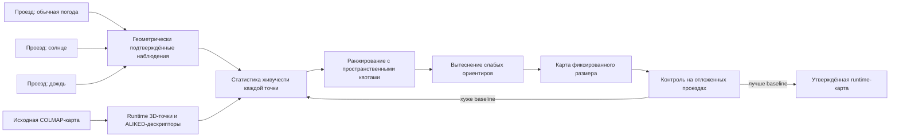

# MSLD: многосессионная дистилляция ориентиров

## Идея

MSLD рассматривает визуальную карту не как неизменяемый набор всех когда-либо
найденных признаков, а как ограниченную популяцию 3D-ориентиров. Робот собирает
новые независимые проезды, после чего офлайн оценивается, какие ориентиры
действительно помогают локализации в разных условиях.



Ключевой принцип:

> Размер карты не растёт. Новый устойчивый ориентир или дескриптор занимает
> место менее полезного элемента.

## Почему меньшая карта может работать лучше

Для каждого query-дескриптора выбираются ближайший и второй ближайший кандидаты.
Соответствие принимается ratio test:

\[
r = \frac{d_1}{d_2} < \tau.
\]

Большой банк содержит много похожих признаков. Тогда ложный или неоднозначный
кандидат уменьшает разницу между \(d_1\) и \(d_2\), значение \(r\) растёт, и
правильное соответствие отбрасывается. Удаление слабых кандидатов может
одновременно:

- сократить время поиска;
- уменьшить perceptual aliasing;
- улучшить ratio test;
- увеличить число корректных 2D–3D пар;
- увеличить число PnP-inliers.

Стоимость точного поиска приблизительно линейна по размеру банка:

\[
T_{match}=O(QD),
\]

где \(Q\) — число query-дескрипторов, \(D\) — число дескрипторов карты.

## Наблюдение точки

Точка считается успешно наблюдавшейся только после геометрической проверки:

1. ALIKED-дескриптор прошёл ratio test.
2. Получено соответствие 2D–3D.
3. PnP/RANSAC нашёл позу.
4. Ошибка репроекции точки не превышает порог.
5. Точка находится перед камерой.

Ошибка репроекции:

\[
e_{i,t}=\left\|u_{i,t}-\pi(K,T_t,X_i)\right\|_2,
\]

где \(X_i\) — 3D-точка, \(u_{i,t}\) — найденная 2D-фича, \(T_t\) — поза
камеры, \(K\) — интринсики, \(\pi\) — проекция.

Успех:

\[
y_{i,t}=\mathbb{1}[e_{i,t}\le e_{max} \land z_{i,t}>0].
\]

## Вероятностная живучесть

Для каждой точки используется Beta-распределение:

\[
p_i \sim Beta(\alpha_i,\beta_i).
\]

После подтверждённого наблюдения:

\[
\alpha_i \leftarrow \alpha_i+1.
\]

После достоверного отсутствия ожидаемо видимой точки:

\[
\beta_i \leftarrow \beta_i+1.
\]

Средняя оценка:

\[
E[p_i]=\frac{\alpha_i}{\alpha_i+\beta_i}.
\]

Для ранжирования безопаснее использовать нижнюю доверительную границу, а не
сырой процент. Поэтому 100 успешных наблюдений из 100 получают больший приоритет,
чем два из двух.

Соседние кадры одного видео коррелированы. Основная единица подтверждения —
независимая сессия, а не кадр:

\[
S_i=\sum_s \mathbb{1}[X_i\text{ подтверждена в сессии }s].
\]

## Итоговый рейтинг

Одной частоты наблюдения недостаточно. Повторяющийся забор может быть виден
всегда, но иметь низкую уникальность. Практический рейтинг:

\[
Q_i=w_sS_i+w_pP_i+w_gG_i+w_aA_i-w_e\bar e_i.
\]

Здесь:

- \(S_i\) — число независимых сессий;
- \(P_i\) — доля геометрически подтверждённых совпадений;
- \(G_i\) — геометрическая полезность для PnP;
- \(A_i\) — разнообразие условий наблюдения;
- \(\bar e_i\) — средняя ошибка репроекции.

Первый прототип использует:

\[
Q_i=1000S_i+20\log(1+n_i)+10P_i-\min(\bar e_i,50).
\]

Большой вес \(S_i\) заставляет переживать отбор точки, подтверждённые и в
обычной, и в солнечной сессии.

## Фиксированный бюджет

Ограничиваются отдельно 3D-точки и дескрипторы:

\[
|\mathcal M_X|\le N_{max},\qquad |\mathcal M_D|\le D_{max}.
\]

Искомая карта:

\[
\mathcal M^*=\arg\max_{\mathcal M}\sum_{i\in\mathcal M}Q_i
\]

при ограничениях покрытия:

\[
\forall b:\quad N_b\ge N_{min,b},
\]

где \(b\) — пространственный интервал маршрута. Отбор выполняется внутри
интервалов, поэтому один текстурный фасад не может вытеснить весь остальной
маршрут.

## Защита от уничтожения карты плохим проездом

Отрицательная статистика не обновляется, если:

- локализация кадра ненадёжна;
- объектив закрыт каплей или грязью;
- кадр размыт, пересвечен или завис;
- глобально исчезла большая доля ожидаемых ориентиров;
- точка вне поля зрения или закрыта препятствием.

Рабочая карта никогда не изменяется напрямую. Используются четыре состояния:

```text
base map -> statistics -> candidate map -> validated map
```

Candidate принимается только если не ухудшает старые контрольные поездки и
улучшает новые условия.

## Предварительный результат

Тест выполнен на `1-2/front_shard/03_of_25` с обычным видео и солнечным
`test_neg`.

| Банк | 3D-точки | Дескрипторы | Recall@20 | Min inliers | Sunny median | Median time |
|---|---:|---:|---:|---:|---:|---:|
| baseline | 30 200 | 244 899 | 0.95 | 18 | 26 | 86.21 мс |
| stable 50% | 15 100 | 128 331 | 1.00 | 27 | 44 | 71.83 мс |
| stable 25% | 7 550 | 68 723 | 1.00 | 43 | 58 | 65.41 мс |
| random 25% | 7 550 | 61 593 | 0.60 | 8 | 14 | 66.66 мс |

Результат подтверждает, что стабильностный отбор отличается от простой
компрессии и способен улучшать соответствия.

## Возможность отказаться от шардов

Дистилляция уменьшает главный недостаток единой карты — размер descriptor bank.
Однако отказ от шардов требует отдельного полного теста.

После уменьшения полного банка в \(k\) раз ожидаемая стоимость matching также
приблизительно уменьшается в \(k\) раз:

\[
T_{full,distilled}\approx\frac{T_{full}}{k}.
\]

Единая карта допустима, если одновременно выполняются:

- latency укладывается в цикл управления на Jetson;
- GPU-память достаточна;
- recall не ниже шардированного режима;
- нет ложных фиксов между похожими участками маршрута;
- глобальный PnP стабилен по всей поездке.

Следующий эксперимент должен дистиллировать полную `1-2/front_full` и сравнить
её с текущими 25 шардами на полном видео. До этого шарды остаются рабочим
страхующим решением.

## GUI

Каждый стабильный экспериментальный вариант автоматически получает:

```text
maps/stable_XX/gui/
├── images/
├── sparse/0/
└── gui.json
```

В COLMAP GUI указываются `image_path` из `gui.json` и модель из `sparse/0`.
Фотографии представлены символическими ссылками, поэтому не дублируют датасет.
