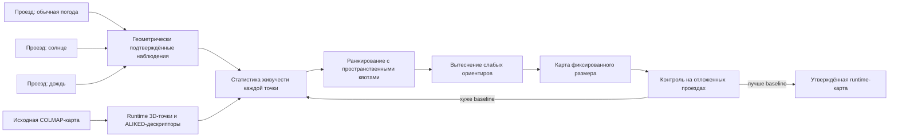

# MSLD: многосессионная дистилляция ориентиров

Полное название метода — **Multi-Session Landmark Distillation**, или
**многосессионная дистилляция визуальных ориентиров**.

## Постановка задачи

Робот должен многократно проходить известный уличный маршрут при изменяющихся
условиях: солнце и тень, сухая и мокрая поверхность, сезонные изменения,
пешеходы, автомобили, временные ограждения и небольшие изменения ракурса.
Исходная COLMAP/GLOMAP-карта хорошо описывает геометрию сцены в момент съёмки,
но не обязана быть оптимальной картой для последующей локализации.

Реконструкция решает задачу

\[
\min_{T_j,X_i}\sum_{(i,j)\in\mathcal O}
\rho\left(\left\|u_{ij}-\pi(K_j,T_j,X_i)\right\|_2^2\right),
\]

то есть подбирает позы камер \(T_j\) и точки \(X_i\), хорошо объясняющие
наблюдения обучающего проезда. Runtime-локализация решает другую задачу:

\[
T_q^*=\arg\max_T
\left|\operatorname{Inliers}\left(
\{u_k\leftrightarrow X_{m(k)}\},T
\right)\right|.
\]

Ей нужна не максимальная полнота реконструкции, а небольшой набор уникальных,
геометрически полезных и повторно наблюдаемых ориентиров. Поэтому хорошая
реконструкционная карта и хорошая навигационная карта — не одно и то же.

## Основные проблемы исходной карты

### Избыточность

На одном фасаде, заборе или кусте могут находиться тысячи похожих точек. Они
увеличивают банк дескрипторов, память и время поиска, но не дают пропорционального
роста информации о позе.

### Неустойчивость среды

Часть точек принадлежит объектам, которые исчезают или меняются: машинам,
людям, листве, бликам, лужам, теням, грязи и временным конструкциям. Такая точка
может быть геометрически корректной в исходной реконструкции, но бесполезной в
другую погоду.

### Perceptual aliasing

Разные места могут выглядеть сходно. Повторяющиеся секции забора, окна и
однотонные стены порождают близкие дескрипторы и конкурируют с правильным
соответствием. Увеличение банка в этом случае способно ухудшить, а не улучшить
локализацию.

### Неравномерное покрытие

Если оставить только глобально самые часто наблюдаемые точки, они соберутся на
нескольких богатых текстурой участках. Остальная часть маршрута останется без
достаточной геометрической поддержки. Поэтому отбор обязан учитывать положение
точки вдоль маршрута.

### Коррелированность кадров

Сто соседних кадров одного проезда не являются ста независимыми доказательствами
стабильности. Они сняты почти из одной позиции, одним сенсором и при одной
погоде. Главная единица доказательства — независимый проезд, а кадры внутри него
дают уточняющую статистику.

## Идея

MSLD рассматривает визуальную карту не как неизменяемый набор всех когда-либо
найденных признаков, а как ограниченную популяцию 3D-ориентиров. Робот собирает
новые независимые проезды, после чего офлайн оценивается, какие ориентиры
действительно помогают локализации в разных условиях.



Ключевой принцип:

> Размер карты не растёт. Новый устойчивый ориентир или дескриптор занимает
> место менее полезного элемента.

Иными словами, карта рассматривается как популяция ограниченного размера.
Каждый новый проезд не просто добавляет признаки, а создаёт наблюдения для
конкуренции ориентиров. Полезные ориентиры сохраняются, ненадёжные постепенно
вытесняются, но рабочая карта меняется только после независимой проверки
кандидата.

## Текущий runtime-пайплайн

Для входного изображения \(I_t\) ALIKED извлекает ключевые точки и локальные
дескрипторы:

\[
\mathcal F_t=\{(u_k,d_k,s_k)\}_{k=1}^{Q_t},
\]

где \(u_k\) — координата, \(d_k\) — дескриптор, \(s_k\) — уверенность
детектора. В карте хранятся 3D-точки \(X_i\) и один или несколько связанных с
ними дескрипторов \(D_i\).

После поиска ближайших дескрипторов и ratio test формируются пары

\[
\mathcal C_t=\{u_k\leftrightarrow X_{m(k)}\}.
\]

PnP/RANSAC оценивает позу и отделяет геометрически согласованные пары от
выбросов. Количество inliers — не абсолютная мера истины, но важный индикатор
того, насколько банк карты объясняет текущий кадр.

Время грубого полного сопоставления растёт приблизительно как

\[
T_{match}\propto Q_tD,
\]

где \(D\) — общее число дескрипторов банка. Именно поэтому бесконечное
насыщение карты новыми дескрипторами несовместимо с ограниченным Jetson.

## Почему меньшая карта может работать лучше

Для каждого query-дескриптора выбираются ближайший и второй ближайший кандидаты.
Соответствие принимается ratio test:

\[
r = \frac{d_1}{d_2} < \tau.
\]

Большой банк содержит много похожих признаков. Тогда ложный или неоднозначный
кандидат уменьшает разницу между \(d_1\) и \(d_2\), значение \(r\) растёт, и
правильное соответствие отбрасывается. Удаление слабых кандидатов может
одновременно:

- сократить время поиска;
- уменьшить perceptual aliasing;
- улучшить ratio test;
- увеличить число корректных 2D–3D пар;
- увеличить число PnP-inliers.

Стоимость точного поиска приблизительно линейна по размеру банка:

\[
T_{match}=O(QD),
\]

где \(Q\) — число query-дескрипторов, \(D\) — число дескрипторов карты.

## Наблюдение точки

Точка считается успешно наблюдавшейся только после геометрической проверки:

1. ALIKED-дескриптор прошёл ratio test.
2. Получено соответствие 2D–3D.
3. PnP/RANSAC нашёл позу.
4. Ошибка репроекции точки не превышает порог.
5. Точка находится перед камерой.

Ошибка репроекции:

\[
e_{i,t}=\left\|u_{i,t}-\pi(K,T_t,X_i)\right\|_2,
\]

где \(X_i\) — 3D-точка, \(u_{i,t}\) — найденная 2D-фича, \(T_t\) — поза
камеры, \(K\) — интринсики, \(\pi\) — проекция.

Успех:

\[
y_{i,t}=\mathbb{1}[e_{i,t}\le e_{max} \land z_{i,t}>0].
\]

Одного descriptor match недостаточно: он может относиться к похожему месту.
Только соответствие, согласованное с общей PnP-позой, считается положительным
наблюдением. Это принципиально отделяет MSLD от простого подсчёта ближайших
дескрипторов.

Отрицательное наблюдение ещё сложнее. Отсутствие match не означает, что точка
стала плохой. Она могла оказаться вне кадра, быть закрыта человеком или не
детектироваться из-за капли на объективе. Понижать её живучесть можно только
если текущая поза надёжна, точка должна проецироваться в изображение и весь кадр
не имеет признаков глобальной деградации.

## Вероятностная живучесть

Для каждой точки используется Beta-распределение:

\[
p_i \sim Beta(\alpha_i,\beta_i).
\]

После подтверждённого наблюдения:

\[
\alpha_i \leftarrow \alpha_i+1.
\]

После достоверного отсутствия ожидаемо видимой точки:

\[
\beta_i \leftarrow \beta_i+1.
\]

Средняя оценка:

\[
E[p_i]=\frac{\alpha_i}{\alpha_i+\beta_i}.
\]

Для ранжирования безопаснее использовать нижнюю доверительную границу, а не
сырой процент. Поэтому 100 успешных наблюдений из 100 получают больший приоритет,
чем два из двух.

Соседние кадры одного видео коррелированы. Основная единица подтверждения —
независимая сессия, а не кадр:

\[
S_i=\sum_s \mathbb{1}[X_i\text{ подтверждена в сессии }s].
\]

Для разных условий полезно хранить раздельные события:

\[
y_{i,s,c}\in\{0,1\},
\]

где \(s\) — проезд, а \(c\) — класс условий: солнце, пасмурно, дождь, сезон или
камера. Тогда устойчивость можно оценивать не только средним значением, но и
худшим условием:

\[
R_i^{worst}=\min_c
\frac{\alpha_{i,c}}{\alpha_{i,c}+\beta_{i,c}}.
\]

Это не позволяет точке, идеальной только в солнечную погоду, вытеснить точку,
которая немного слабее, но работает во всех доступных условиях.

## Итоговый рейтинг

Одной частоты наблюдения недостаточно. Повторяющийся забор может быть виден
всегда, но иметь низкую уникальность. Практический рейтинг:

\[
Q_i=w_sS_i+w_pP_i+w_gG_i+w_aA_i-w_e\bar e_i.
\]

Здесь:

- \(S_i\) — число независимых сессий;
- \(P_i\) — доля геометрически подтверждённых совпадений;
- \(G_i\) — геометрическая полезность для PnP;
- \(A_i\) — разнообразие условий наблюдения;
- \(\bar e_i\) — средняя ошибка репроекции.

Первый прототип использует:

\[
Q_i=1000S_i+20\log(1+n_i)+10P_i-\min(\bar e_i,50).
\]

Большой вес \(S_i\) заставляет переживать отбор точки, подтверждённые и в
обычной, и в солнечной сессии.

Для зрелой версии рейтинг должен учитывать также уникальность и вклад в
геометрию:

\[
U_i=1-\max_{j\ne i}\operatorname{sim}(D_i,D_j),
\]

\[
G_i=f(\text{baseline},\text{view diversity},\text{PnP leverage}).
\]

Уникальность штрафует ориентиры, которые легко спутать с другим местом.
Геометрический вклад не даёт оставить множество почти коллинеарных точек,
которые увеличивают inliers, но плохо ограничивают позу.

Итоговую задачу можно записать как

\[
Q_i=w_RR_i+w_SS_i+w_UU_i+w_GG_i+w_AA_i-w_E\bar e_i-w_CC_i,
\]

где \(C_i\) — стоимость хранения всех дескрипторов этой точки.

## Якорные и условные ориентиры

Не обязательно требовать, чтобы каждая точка была видна при любых условиях.
Практичнее разделить банк на два слоя:

1. **Якорные ориентиры** — подтверждены в нескольких независимых условиях,
   уникальны и геометрически надёжны. Они образуют постоянное ядро карты.
2. **Условные ориентиры** — полезны только при солнце, дожде, зимой или при
   определённом ракурсе. Они занимают ограниченную квоту и дополняют ядро.

Если оставить только универсальные точки, сложный участок может лишиться
достаточного количества признаков. Условный слой сохраняет recall, не позволяя
ему бесконтрольно увеличивать карту.

## Фиксированный бюджет

Ограничиваются отдельно 3D-точки и дескрипторы:

\[
|\mathcal M_X|\le N_{max},\qquad |\mathcal M_D|\le D_{max}.
\]

Искомая карта:

\[
\mathcal M^*=\arg\max_{\mathcal M}\sum_{i\in\mathcal M}Q_i
\]

при ограничениях покрытия:

\[
\forall b:\quad N_b\ge N_{min,b},
\]

где \(b\) — пространственный интервал маршрута. Отбор выполняется внутри
интервалов, поэтому один текстурный фасад не может вытеснить весь остальной
маршрут.

Кроме нижней квоты полезно ограничить верхнюю:

\[
N_{min,b}\le N_b\le N_{max,b}.
\]

Тогда богатый участок не поглощает бюджет. Внутри каждого интервала сначала
сохраняются якоря, затем условные точки, после чего остаток заполняется по
рейтингу. Отдельный лимит дескрипторов важен потому, что две карты с одинаковым
числом 3D-точек могут иметь совершенно разное время inference.

## Как карта насыщается без бесконечного роста

Новый проезд способен дать новый дескриптор уже существующей 3D-точки. Он
добавляется не как новая независимая точка, а как альтернативное описание того
же ориентира при другом освещении:

\[
D_i=\{d_i^{(1)},d_i^{(2)},\ldots,d_i^{(m_i)}\}.
\]

Но число вариантов также ограничено. Для точки выбирается медоид или небольшой
набор представителей кластеров:

\[
d_i^*=\arg\min_{d\in D_i}\sum_{d'\in D_i}\operatorname{dist}(d,d').
\]

При необходимости хранятся несколько медоидов разных условий. Новый дескриптор
принимается только если повышает recall контрольных сессий, а затем вытесняет
менее полезный. Поэтому насыщение означает улучшение распределения банка, а не
его монотонный рост.

## Защита от уничтожения карты плохим проездом

Отрицательная статистика не обновляется, если:

- локализация кадра ненадёжна;
- объектив закрыт каплей или грязью;
- кадр размыт, пересвечен или завис;
- глобально исчезла большая доля ожидаемых ориентиров;
- точка вне поля зрения или закрыта препятствием.

Рабочая карта никогда не изменяется напрямую. Используются четыре состояния:

```text
base map -> statistics -> candidate map -> validated map
```

Candidate принимается только если не ухудшает старые контрольные поездки и
улучшает новые условия.

Формально кандидат принимается, если

\[
R_{new,c}\ge R_{base,c}-\varepsilon_c\quad\forall c
\]

и существует хотя бы одно сложное условие \(c^*\), для которого

\[
R_{new,c^*}>R_{base,c^*}+\delta.
\]

Кроме recall проверяются ложные скачки позиции, longest LOST streak, минимум и
квантили inliers, latency, память и пространственное покрытие. Один удачный
средний показатель не имеет права скрыть провал на коротком участке маршрута.

## Оффлайн-конвейер MSLD

### 1. Заморозка baseline

Сохраняются рабочая карта, контрольные суммы, параметры ALIKED/PnP и результаты
эталонных прогонов. Baseline остаётся доступным для отката.

### 2. Сбор независимых сессий

Записываются проезды в отличающихся условиях. Сессии делятся на обучающие и
контрольные целиком, а не случайными соседними кадрами.

### 3. Повторная локализация

Каждый кадр локализуется по baseline. Для каждой 3D-точки сохраняются факт
ожидаемой видимости, descriptor match, попадание в PnP-inliers, репроекционная
ошибка, ракурс и условие съёмки.

### 4. Агрегация по сессиям

Статистика кадров превращается в статистику независимых проездов. Плохие кадры
и ненадёжные позы исключаются из отрицательных наблюдений.

### 5. Ранжирование и пространственный отбор

Точки сортируются по \(Q_i\) внутри пространственных интервалов. Соблюдаются
бюджеты 3D-точек и дескрипторов, квоты якорного и условного слоёв.

### 6. Построение candidate map

Создаётся новый runtime bank и соответствующая GUI-модель. Исходная рабочая
карта не перезаписывается.

### 7. Проверка на holdout-сессиях

Candidate прогоняется по видео, которые не участвовали в ранжировании. Сначала
проверяется отсутствие регрессии на обычной погоде, затем выигрыш на сложных
условиях.

### 8. Продвижение или откат

Только прошедший все ограничения candidate становится validated map. Иначе
изменяются веса, квоты или бюджет, а baseline остаётся рабочим.

## Предварительный результат

Тест выполнен на `1-2/front_shard/03_of_25` с обычным видео и солнечным
`test_neg`.

| Банк | 3D-точки | Дескрипторы | Recall@20 | Min inliers | Sunny median | Median time |
|---|---:|---:|---:|---:|---:|---:|
| baseline | 30 200 | 244 899 | 0.95 | 18 | 26 | 86.21 мс |
| stable 50% | 15 100 | 128 331 | 1.00 | 27 | 44 | 71.83 мс |
| stable 25% | 7 550 | 68 723 | 1.00 | 43 | 58 | 65.41 мс |
| random 25% | 7 550 | 61 593 | 0.60 | 8 | 14 | 66.66 мс |

Результат подтверждает, что стабильностный отбор отличается от простой
компрессии и способен улучшать соответствия.

Главное сравнение — `stable 25%` против `random 25%`. Одинаковое число точек
само по себе не объясняет улучшение: случайная четверть резко ухудшила recall,
тогда как выбранная по стабильности четверть повысила минимальное число inliers.

Однако это пока доказательство механизма, а не окончательное доказательство
обобщения. Обучающая и проверочная части получены из имеющихся сессий. Следующий
обязательный этап — полностью независимые проезды, не участвовавшие ни в оценке
живучести, ни в подборе порогов.

## Возможность отказаться от шардов

Дистилляция уменьшает главный недостаток единой карты — размер descriptor bank.
Однако отказ от шардов требует отдельного полного теста.

После уменьшения полного банка в \(k\) раз ожидаемая стоимость matching также
приблизительно уменьшается в \(k\) раз:

\[
T_{full,distilled}\approx\frac{T_{full}}{k}.
\]

Единая карта допустима, если одновременно выполняются:

- latency укладывается в цикл управления на Jetson;
- GPU-память достаточна;
- recall не ниже шардированного режима;
- нет ложных фиксов между похожими участками маршрута;
- глобальный PnP стабилен по всей поездке.

Следующий эксперимент должен дистиллировать полную `1-2/front_full` и сравнить
её с текущими 25 шардами на полном видео. До этого шарды остаются рабочим
страхующим решением.

### Почему сначала разумнее уменьшить число шардов

Полный отказ от шардов сразу объединяет две неопределённости: качество MSLD и
глобальное perceptual aliasing. Более безопасный путь:

```text
25 текущих шардов
        ↓
5–8 крупных дистиллированных шардов
        ↓
2–3 очень крупных сегмента
        ↓
единая карта, только если метрики это позволяют
```

Крупные шарды уменьшают количество границ, переключений и специальных зон, но
ещё сохраняют грубое пространственное ограничение поиска. Это даёт большую часть
простоты единой карты без максимального риска ложной глобальной релокализации.

Пусть полный исходный банк содержит \(D_{full}\) дескрипторов, а дистилляция
оставляет долю \(r\). При \(S\) одинаковых шардах локальный банк приблизительно
равен

\[
D_{shard}\approx\frac{rD_{full}}{S}+D_{overlap}.
\]

Уменьшение \(r\) позволяет уменьшать \(S\), сохраняя близкую стоимость поиска.
Например, четырёхкратная дистилляция теоретически позволяет сделать шард примерно
в четыре раза крупнее при сопоставимом числе дескрипторов. Реальное значение
определяется измерениями, потому что overlap и распределение точек неравномерны.

### Условие перехода к единой карте

Единая карта становится практичной, если

\[
T_{extract}+T_{match}(rD_{full})+T_{PnP}\le T_{budget},
\]

\[
M_{model}+M_{bank}(rD_{full})\le M_{Jetson},
\]

а вероятность ложного глобального фикса не возрастает относительно шардов.
Таким образом, вопрос решается не визуальным размером файла, а одновременно
latency, памятью, recall, точностью глобального выбора места и непрерывностью
маршрута.

## Метрики окончательного эксперимента

Для каждого видео и каждого участка маршрута необходимо считать:

- recall при порогах 15 и 20 inliers;
- медиану, минимум и квантили inliers;
- longest LOST streak;
- число ложных скачков глобального узла;
- ошибку относительно ожидаемой последовательности узлов;
- медианное и p95 время полного кадра;
- размер банка в 3D-точках, дескрипторах, байтах RAM/VRAM;
- число участков, не выполняющих минимальную пространственную квоту;
- матрицу путаницы между удалёнными похожими участками маршрута.

Для сравнения конфигураций полезна целевая функция

\[
J(\mathcal M)=
\lambda_RR-lambda_LL-lambda_FF-lambda_TT-lambda_MM,
\]

где \(R\) — recall, \(L\) — длительность LOST, \(F\) — ложные фиксы,
\(T\) — latency, \(M\) — память. Но окончательное решение должно дополнительно
удовлетворять жёстким ограничениям безопасности: отсутствие опасных ложных
переходов нельзя компенсировать выигрышем средней скорости.

## Итоговая формулировка метода

MSLD — это офлайн-обучение структуры визуальной карты без переобучения ALIKED.
Обучаемым объектом становится не нейросеть, а состав банка ориентиров и набор
дескрипторов каждого ориентира.

Искомая карта решает задачу

\[
\mathcal M^*=\arg\max_{\mathcal M}
P(\text{correct localization}\mid\mathcal M,\mathcal S)
\]

при ограничениях

\[
|X|\le N_{max},\quad |D|\le D_{max},\quad
T(\mathcal M)\le T_{budget},\quad M(\mathcal M)\le M_{budget},
\]

и обязательном покрытии всего маршрута.

Смысл метода не в том, чтобы найти точки с красивым показателем «100%». Его
цель — построить минимальный, разнообразный и геометрически достаточный набор
ориентиров, который максимизирует вероятность правильной локализации на новых
проездах. Именно независимая проверка отличает реальную lifelong-карту от карты,
подогнанной под несколько уже известных видео.

## GUI

Каждый стабильный экспериментальный вариант автоматически получает:

```text
maps/stable_XX/gui/
├── images/
├── sparse/0/
└── gui.json
```

В COLMAP GUI указываются `image_path` из `gui.json` и модель из `sparse/0`.
Фотографии представлены символическими ссылками, поэтому не дублируют датасет.
